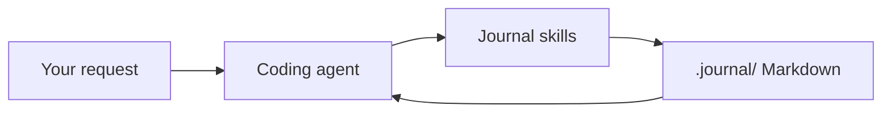

# Filesystem Journal

Durable project memory for coding agents.

Filesystem Journal turns plans, research, decisions, and implementation notes
into linked Markdown that Codex and Claude Code can resume automatically. It is
project-local, inspectable, and works without a server, database, or account.

## How it works



- `AGENTS.md` makes the workflow available in every session.
- Skills handle planning, research, decisions, documentation, recall, and
  session closure.
- Optional hooks remind the agent to follow the workflow and verify closure.
- Hooks never write journal entries themselves.

## Install

Requires Node.js 18 or newer. From this repository checkout:

```bash
./install.sh install --target /path/to/project
```

The installer detects Codex or Claude Code. Select a harness explicitly when
needed:

```bash
./install.sh install --target /path/to/project --harness codex
./install.sh install --target /path/to/project --harness claude-code
./install.sh install --target /path/to/project --all
```

Then use your coding agent normally. The journal workflow is default-on for
meaningful work and stays out of the way for read-only or trivial requests.

## Lifecycle

```bash
./install.sh status --target /path/to/project
./install.sh doctor --target /path/to/project
./install.sh upgrade --target /path/to/project
./install.sh uninstall --target /path/to/project
```

Installation and uninstallation preserve user-owned configuration. A full
uninstall removes journal tooling but keeps `.journal/` history so it can be
reinstalled later.

## Storage

```text
.journal/
  state.json
  work/<work-item>/
    work.md
    journal/
    decisions/
    docs/
    _research/
```

Markdown is the source of truth. See [spec.md](spec.md) for the data model and
workflow contracts.

## Status

Codex and Claude Code are supported. OpenCode, Pi, and Zed adapters are planned.
