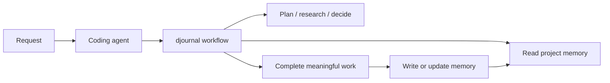

# djournal

Portable project memory for coding agents, readable by humans.

djournal records the reasoning path of the work: plans, research, decisions,
changes, validation, and next steps. It lets you start in Codex, continue in
Claude Code, switch models, survive context compaction, and still reload the
same project state from plain Markdown.

Code preserves what exists. djournal preserves why it exists.

> **Files are memory. Indexes are projections.**

## Why djournal exists

djournal is built for product and engineering work that moves across sessions,
models, people, and tools.

### Continue across tools

Long coding sessions do not survive tool boundaries well when the only handoff
format is a transcript. A useful session may start in Codex, continue in Claude
Code, and later resume somewhere else. The journal is the portable handoff
layer: each agent can read the same Markdown spine, follow the same decisions
and research links, and close its work in the same structure.

The memory belongs to the project, not to a chat session, model, harness,
database, or proprietary service.

### Preserve the reasoning code cannot show

Code shows what a system does. It rarely shows why it became that way, what was
tried, which constraints mattered, which options were rejected, or what should
happen next.

Chat history preserves too much, with weak structure and poor portability.
Conventional documentation usually captures polished outcomes after the fact.
Static analysis can inspect the code as it is, but it cannot reliably recover
the historical decisions that shaped it.

djournal records that missing layer while the work happens.

### Share institutional knowledge

In AI-accelerated teams, traditional documentation can become stale almost as
soon as it is written. Product specs, implementation notes, and architectural
rationale need to be produced as a by-product of product and engineering work,
not as a separate ritual.

djournal gives that by-product a durable shape. The same entries that let an
agent resume work also become institutional knowledge: reviewable by humans,
searchable with ordinary tools, versioned through Git, and recallable by
whichever model or harness the team uses next.

### Let memory compound

A journal can start from nothing. The first entries are mostly orientation:
current state, open questions, and next steps. As the work accumulates, resume
behavior changes. The agent is no longer guessing from a cold codebase or
wandering through broad exploration. It reloads a shaped history: what mattered
before, what was decided, what remains unresolved, and where the next useful
move probably is.

The journal turns past work into focused guidance.

## Manifesto

1. **Memory should be authored, not inferred.** Decisions and evidence deserve
   explicit records.
2. **The source should be readable.** Humans and agents should consume the same
   artifacts without a translation layer.
3. **History is knowledge.** Diffs, attribution, chronology, and supersession
   explain how the current state came to exist.
4. **Structure should be sufficient, not maximal.** YAML carries stable
   metadata; Markdown carries meaning; links carry relationships.
5. **Tools should remain replaceable.** Memory must survive changes in models,
   agent harnesses, databases, vendors, and retrieval systems.
6. **The workflow should carry the burden.** Maintaining memory should be a
   consequence of meaningful work, not another ritual to remember.

## What djournal records

```text
.journal/
  state.json
  work/<work-item>/
    work.md
    journal/       # plans, implementation, and status
    decisions/     # accepted choices and rationale
    docs/          # durable synthesized references
    _research/     # codebase and web evidence
```

Entries carry structured frontmatter, stable identities, summaries, timestamps,
and typed links. Markdown remains the source of truth.

See [spec.md](spec.md) for the complete data model and workflow contracts.

## How it works



- `AGENTS.md` supplies portable workflow instructions.
- Skills handle planning, research, decisions, documentation, recall, audit,
  reconciliation, and session closure.
- Codex and Claude Code hooks provide reminders and closure validation.
- Hooks never create or modify semantic journal entries.
- Read-only and trivial requests do not generate unnecessary ceremony.

## Why plain Markdown and Git

Markdown is immediately useful. It can be read before an ingestion pipeline
runs, searched with ordinary tools, loaded selectively, reviewed line by line,
and versioned with Git. Frontmatter makes important fields deterministic while
links turn the directory into an explicit graph.

Git already distributes code history. djournal lets teams preserve reasoning
history in the same reviewable medium: who changed the memory, when it changed,
what it referenced, and how it evolved. That makes institutional knowledge easy
for people to inspect and easy for agents to recall.

Google Cloud's draft [Open Knowledge Format](https://cloud.google.com/blog/products/data-analytics/how-the-open-knowledge-format-can-improve-data-sharing/)
formalizes the same broad pattern: knowledge as linked Markdown with YAML
frontmatter, portable through Git and independent of the tools that produce or
consume it. djournal is conceptually aligned with that direction, but uses a
domain-specific schema for project history and is not currently
[OKF v0.1](https://github.com/GoogleCloudPlatform/knowledge-catalog/blob/main/okf/SPEC.md)
conformant.

## Why not only RAG or a knowledge graph?

RAG, embeddings, full-text indexes, and graph views are useful retrieval tools.
They are not ideal as the only durable copy of project memory.

| Layer | What it provides |
| --- | --- |
| djournal Markdown | Canonical meaning, provenance, chronology, and links |
| Git | Review, attribution, history, and team exchange |
| Embeddings / RAG | Semantic retrieval over larger corpora |
| Graph projection | Traversal, visualization, and multi-hop retrieval |

Vector and graph indexes are derived representations: they require ingestion,
can become stale, and may change with the model or extraction pipeline. djournal
keeps the authored source inspectable and lets those indexes be rebuilt when
needed. It complements retrieval infrastructure rather than replacing it.

Large context windows help, but they do not replace authored memory. A million
tokens can hold more text; the agent still needs to know what matters.

## Install

Requires Node.js 18 or newer. Run this from the project you want to equip:

```bash
npm install -g djournal
djournal install
```

The global install gives you the `djournal` and `journal` commands. The
installer targets the current directory and detects Codex or Claude Code. Select
explicitly when needed:

```bash
djournal install --harness codex
djournal install --harness claude-code
djournal install --all
```

If you do not want a global install, use `npx`:

```bash
npx djournal install
```

Then use your coding agent normally.

## Lifecycle

```bash
npx djournal status
npx djournal doctor
npx djournal share
npx djournal sync
npx djournal upgrade
npx djournal uninstall
```

Installation preserves existing agent configuration. Uninstallation removes
djournal's tooling while retaining `.journal/` so the project memory can be
revived later.

Existing `AGENTS.md` and `CLAUDE.md` files are never replaced. djournal adds an
owned block, updates only that block, and removes only that block during
uninstall; surrounding project instructions remain untouched.

`share` promotes the active work item to shared visibility. `sync` performs the
conservative Git-backed exchange for shared work. Local-only work is skipped by
sync.

## Status

Codex and Claude Code are supported. OpenCode, Pi, and Zed adapters are planned.

Git-backed sharing and automatic sync are being implemented conservatively so
local-only work remains private by default.

## Contributing and releases

Pull request titles use Conventional Commit form, such as
`feat(installer): support zed` or `fix: preserve existing hooks`. Merges to
`main` are released automatically after the initial npm/OIDC bootstrap. Before
1.0, breaking changes increment the minor version; from 1.0 onward they
increment the major version.

djournal is licensed under the [Apache License 2.0](LICENSE).

## Documentation

- [Installation and repository layouts](docs/installation.md)
- [Remote Git sync setup](docs/remote-sync.md)
- [Architecture and data model](docs/architecture.md)
- [Visibility and sharing](docs/visibility-and-sharing.md)
- [Djournal in practice](docs/djournal-in-practice.md)
- [Uninstalling and reinstalling](docs/uninstalling.md)
