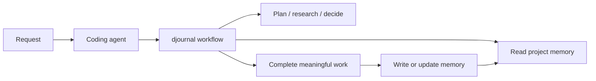

# djournal

Durable project memory for coding agents, readable by humans.

djournal records the path of the work—plans, research, decisions, changes, and
next steps—as linked Markdown inside your project. Codex and Claude Code can use
that memory automatically across sessions without a database, account, or
proprietary service.

> **Files are memory. Indexes are projections.**

## Why djournal exists

Code preserves what a system does. It rarely preserves why it became that way,
what was tried, which evidence mattered, or what should happen next.

Chat transcripts preserve too much. Conventional documentation is usually
written too late. Retrieval systems can find fragments, but they cannot recover
reasoning that was never recorded.

djournal makes project memory part of doing the work. Skills capture durable
context when work becomes meaningful; optional hooks make the workflow
default-on without writing entries behind the agent's back.

## Manifesto

1. **Memory should be authored, not inferred.** Decisions and evidence deserve
   explicit records.
2. **The source should be readable.** Humans and agents should consume the same
   artifacts without a translation layer.
3. **History is knowledge.** Diffs, attribution, chronology, and supersession
   explain how the current state came to exist.
4. **Structure should be sufficient, not maximal.** YAML carries stable
   metadata; Markdown carries meaning; links carry relationships.
5. **Tools should remain replaceable.** Memory must survive changes in models,
   agent harnesses, databases, and vendors.
6. **The workflow should carry the burden.** Maintaining memory should be a
   consequence of meaningful work, not another ritual to remember.

## Why plain Markdown

Markdown is immediately useful. It can be read before an ingestion pipeline
runs, searched with ordinary tools, loaded selectively, reviewed line by line,
and versioned with Git. Frontmatter makes important fields deterministic while
links turn the directory into an explicit graph.

Google Cloud's draft [Open Knowledge Format](https://cloud.google.com/blog/products/data-analytics/how-the-open-knowledge-format-can-improve-data-sharing/)
formalizes the same broad pattern: knowledge as linked Markdown with YAML
frontmatter, portable through Git and independent of the tools that produce or
consume it. djournal is conceptually aligned with that direction, but uses a
domain-specific schema for project history and is not currently
[OKF v0.1](https://github.com/GoogleCloudPlatform/knowledge-catalog/blob/main/okf/SPEC.md)
conformant.

## Why not only RAG or a knowledge graph?

RAG, embeddings, full-text indexes, and graph views are useful retrieval tools.
They are not ideal as the only durable copy of project memory.

| Layer | What it provides |
| --- | --- |
| djournal Markdown | Canonical meaning, provenance, chronology, and links |
| Git | Review, attribution, history, and team exchange |
| Embeddings / RAG | Semantic retrieval over larger corpora |
| Graph projection | Traversal, visualization, and multi-hop retrieval |

Vector and graph indexes are derived representations: they require ingestion,
can become stale, and may change with the model or extraction pipeline. djournal
keeps the authored source inspectable and lets those indexes be rebuilt when
needed. It complements retrieval infrastructure rather than replacing it.

## What djournal records

```text
.journal/
  state.json
  work/<work-item>/
    work.md
    journal/       # plans, implementation, and status
    decisions/     # accepted choices and rationale
    docs/          # durable synthesized references
    _research/     # codebase and web evidence
```

Entries carry structured frontmatter, stable identities, summaries, timestamps,
and typed links. Markdown remains the source of truth.

## How it works



- `AGENTS.md` supplies portable workflow instructions.
- Skills handle planning, research, decisions, documentation, recall, audit,
  reconciliation, and session closure.
- Codex and Claude Code hooks provide reminders and closure validation.
- Hooks never create or modify semantic journal entries.
- Read-only and trivial requests do not generate unnecessary ceremony.

## Install

Requires Node.js 18 or newer. Run this from the project you want to equip:

```bash
npx djournal install
```

The installer targets the current directory and detects Codex or Claude Code.
Select explicitly when needed:

```bash
npx djournal install --harness codex
npx djournal install --harness claude-code
npx djournal install --all
```

Then use your coding agent normally.

## Lifecycle

```bash
npx djournal status
npx djournal doctor
npx djournal upgrade
npx djournal uninstall
```

Installation preserves existing agent configuration. Uninstallation removes
djournal's tooling while retaining `.journal/` so the project memory can be
revived later.

Existing `AGENTS.md` and `CLAUDE.md` files are never replaced. djournal adds an
owned block, updates only that block, and removes only that block during
uninstall; surrounding project instructions remain untouched.

See [spec.md](spec.md) for the complete data model and workflow contracts.

## Status

Codex and Claude Code are supported. OpenCode, Pi, and Zed adapters are planned.

## Contributing and releases

Pull request titles use Conventional Commit form, such as
`feat(installer): support zed` or `fix: preserve existing hooks`. Merges to
`main` are released automatically after the initial npm/OIDC bootstrap. Before
1.0, breaking changes increment the minor version; from 1.0 onward they
increment the major version.

djournal is licensed under the [Apache License 2.0](LICENSE).
